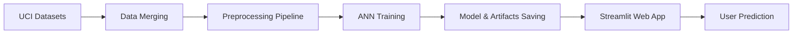

# 🎓🧠 Student Performance ANN Predictor 🧠🎓

[](https://git.io/typing-svg)


[](https://student-performance-ann-regreappr-project.streamlit.app/)

### 🚀 **Predict your final academic grade (G3) using an End-to-End Deep Learning System** 📊

### 🧠 Demographic Factors × Study Habits × ANN = **Precision Grade Forecasting** 🎯

---

## 🌟 **WHAT IS THIS?** 🌟

<table>
<tr>
<td>

### 🎯 **The Mission**

This project builds a robust **AI-powered regression system** to predict a student's final grade (**G3**) based on the **UCI Student Performance Dataset** (Math + Portuguese). It analyzes how demographic, social, and study-related factors influence academic success.

**Think of it as:**
- 🧠 **Brain** = TensorFlow Artificial Neural Network (ANN)
- 📊 **Input** = Study time, failures, family support, etc.
- 🔮 **Output** = Final Grade Prediction (0-20 scale)

</td>
<td>

### 🔥 **Key Features**

✅ **End-to-End Pipeline** from raw CSV to deployed web app
✅ **Robust Preprocessing** handles missing data, scaling & encoding
✅ **Advanced ANN Architecture** with Dropouts & Early Stopping
✅ **Feature Selection** strategy (excludes G1/G2 to prevent leakage)
✅ **State Persistence** using `.keras` model & `.joblib` pipeline
✅ **Interactive UI** built with Streamlit for real-time inference
✅ **Mixed Data Support** handles numeric & categorical inputs

**UseCase Applications:**
- 🏫 **Educators** - Identify at-risk students early
- 🎓 **Students** - Understand impact of study habits
- 📊 **EdTech** - Personalized learning recommendations

</td>
</tr>
</table>

---

## 🛠️ **TECH STACK** 🛠️


| **Category** | **Technologies** |
|--------------|------------------|
| 🐍 **Language** | Python 3.10+ |
| 🧠 **Deep Learning** | TensorFlow, Keras (Sequential API) |
| 📊 **Preprocessing** | Scikit-learn (ColumnTransformer, Pipeline) |
| 🎨 **Frontend** | Streamlit |
| 💾 **Data Handling** | Pandas, NumPy, Joblib |
| 📈 **Data Source** | UCI Machine Learning Repository |

---

## 📂 **PROJECT STRUCTURE** 📂

```
🎓 Student-Performance-ANN/
│
├── 📁 assets/                           # UI Assets (images, banners)
├── 📁 app.py                            # 🚀 Main Streamlit Application
├── 📁 main.ipynb                        # 📓 Training Notebook (EDA + Modeling)
├── 📦 requirements.txt                  # Dependency list
├── 🧠 student_grade_ann_best.keras      # Best trained ANN model
├── 🔧 preprocessor.joblib               # Saved Scikit-learn transformation pipeline
├── 📋 feature_columns.json              # Schema of input features
├── 📊 student-mat.csv                   # Mathematics dataset
├── 📊 student-por.csv                   # Portuguese language dataset
└── 📖 README.md                         # Project documentation
```

---

## 🚀 **QUICK START** 🚀

### **Step 1: Clone the Repository** 📥

```bash
git clone https://github.com/your-username/student-performance-ann.git
cd student-performance-ann
```

### **Step 2: Install Dependencies** 📦

```bash
pip install -r requirements.txt
```

### **Step 3: Run the App** 🎯

```bash
streamlit run app.py
```

### **Step 4: Open in Browser** 🌐

The app will automatically open at: **`http://localhost:8501`**

---

## 🧪 **HOW IT WORKS** 🧪



### **The AI Pipeline:**

1️⃣ **Data Ingestion** → Merges Math (`student-mat.csv`) and Portuguese (`student-por.csv`) datasets.
2️⃣ **Preprocessing Engine** (`ColumnTransformer`):
   - **Numeric**: Median Imputation → Standard Scaling
   - **Categorical**: Most Frequent Imputation → One-Hot Encoding
3️⃣ **Neural Network Architecture**:
   - **Input Layer**: Matches processed feature dimensions
   - **Hidden Layers**: Dense layers with ReLU activation
   - **Regularization**: Dropout layers (0.25-0.30) to prevent overfitting
   - **Output Layer**: Single Linear neuron for regression
4️⃣ **Training**: Adam Optimizer, MSE Loss, EarlyStopping callbacks.
5️⃣ **Deployment**: Loads saved `.keras` model and `.joblib` pipeline to serve predictions.

---

## 📊 **DATASET & FEATURES** 📊

The model treats **30+ input features** to determine academic success:

| **Feature Category** | **Examples** |
|----------------------|-------------|
| 🏠 **Demographics** | `age`, `sex`, `address` (urban/rural), `famsize` |
| 📚 **School Info** | `school` (GP/MS), `reason` for choosing school |
| 📖 **Study Habits** | `studytime`, `failures`, `absences`, `schoolsup` |
| 👪 **Family Context** | `Medu` (Mother's edu), `Fjob`, `famsup`, `famrel` |
| 🍻 **Lifestyle** | `freetime`, `goout`, `Dalc` (weekday alcohol), `health` |

> **Note:** Interim grades `G1` and `G2` are intentionally excluded in some training configurations to create a purely predictive model based on student characteristics rather than past performance.

---

## 👨‍💻 **CONNECT WITH ME** 👨‍💻

[](https://github.com/mayank-goyal09)
[](https://www.linkedin.com/in/mayank-goyal-mg09/)

**Mayank Goyal**
📊 Data Scientist | 🤖 Deep Learning Enthusiast | 🐍 Python Developer

---

## ⭐ **SHOW YOUR SUPPORT** ⭐

Give a ⭐️ if this project inspired your next AI application!

### 🎓 **Built with TensorFlow & ❤️** 🎓
​
